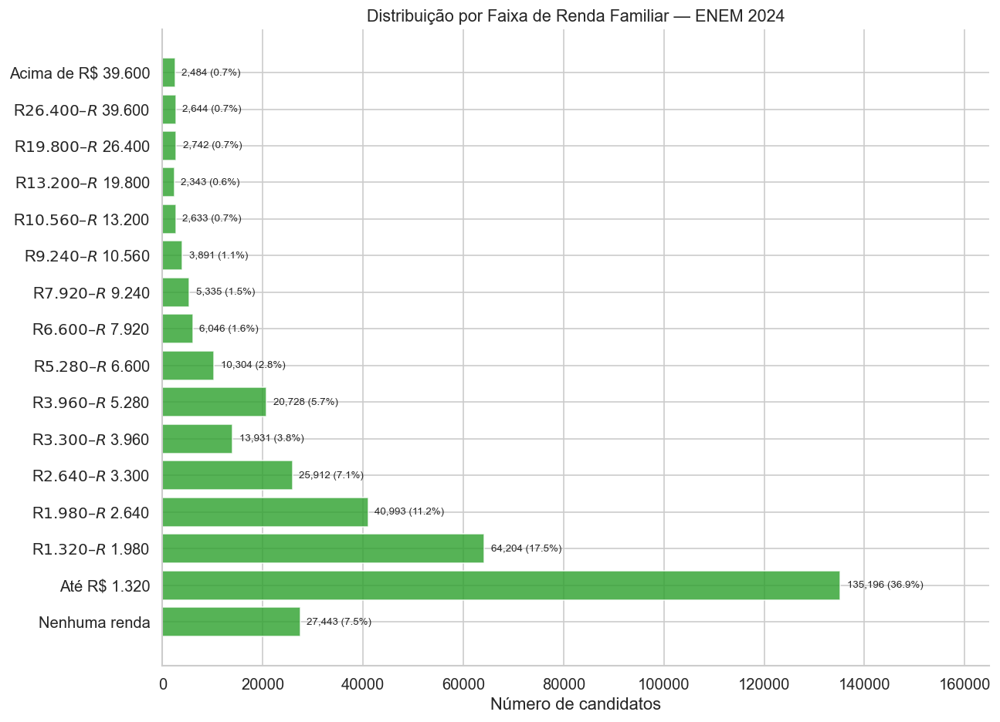
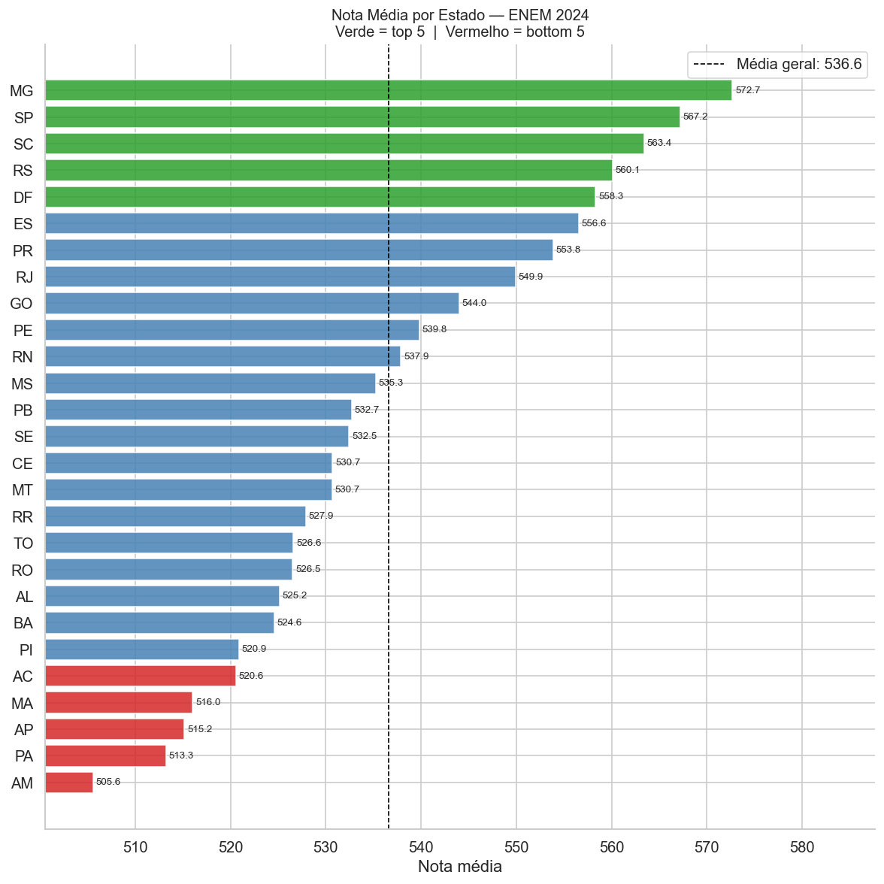

# ENEM Insights

Análise exploratória completa dos microdados do ENEM 2023 investigando desigualdades educacionais no Brasil por renda familiar, tipo de escola, sexo, cor/raça e região.


---

## Motivação

O ENEM é o maior exame do Brasil, com mais de 4 milhões de inscritos por edição. Seus microdados, publicados pelo INEP, permitem estudar padrões de desempenho em escala nacional e revelar desigualdades estruturais no acesso à educação de qualidade.

Este projeto aplica técnicas de Análise Exploratória de Dados (EDA) para responder perguntas como:

- Qual o impacto da renda familiar no desempenho?
- Candidatos de escolas privadas têm vantagem em todas as áreas?
- Como o desempenho varia entre os estados brasileiros?
- Existem diferenças de desempenho por sexo e cor/raça?

---

## Dataset

| Item | Detalhe |
|---|---|
| Fonte | [INEP — Microdados do ENEM 2023](https://www.gov.br/inep/pt-br/acesso-a-informacao/dados-abertos/microdados/enem) |
| Registros totais | ~4,3 milhões de candidatos |
| Amostra utilizada | 500.000 registros |
| Formato original | CSV (separador `;`, encoding `latin-1`) |
| Formato processado | Parquet |

**Variáveis analisadas:**

| Variável | Descrição |
|---|---|
| `NU_NOTA_CN` | Nota — Ciências da Natureza |
| `NU_NOTA_CH` | Nota — Ciências Humanas |
| `NU_NOTA_LC` | Nota — Linguagens e Códigos |
| `NU_NOTA_MT` | Nota — Matemática |
| `NU_NOTA_REDACAO` | Nota — Redação |
| `Q006` | Faixa de renda familiar (A–P) |
| `TP_ESCOLA` | Tipo de escola (Pública / Privada / Exterior) |
| `SG_UF_PROVA` | Estado onde realizou a prova |
| `TP_SEXO` | Sexo do candidato |
| `TP_COR_RACA` | Cor/raça autodeclarada |

---

## Estrutura do Projeto

```
enem-insights/
├── data/
│   ├── raw/                          # Arquivo ZIP original (não versionado)
│   └── processed/                    # Parquet gerado após limpeza
├── notebooks/
│   ├── 01_carregamento_limpeza.ipynb
│   ├── 02_analise_univariada.ipynb
│   ├── 03_analise_bivariada.ipynb    (em breve)
│   ├── 03b_analise_geografica.ipynb  (em breve)
│   └── 04_insights_finais.ipynb      (em breve)
├── src/
│   └── utils.py                      # Mapeamentos, estilo e funções compartilhadas
├── reports/
│   └── figures/                      # Gráficos exportados em PNG
├── .gitignore
├── requirements.txt
└── README.md
```

---

## Notebooks

### 01 — Carregamento e Limpeza
Leitura do arquivo ZIP diretamente via `zipfile`, seleção das colunas de interesse, remoção de candidatos ausentes nas provas (31% do total), aplicação de mapeamentos categóricos e exportação para Parquet.

**Resultado:** dataset limpo com ~345 mil registros e 11 colunas.

### 02 — Análise Univariada
Exploração individual de cada variável: distribuição das notas por área (histogramas + KDE + boxplots), perfil demográfico dos candidatos (escola, sexo, cor/raça, renda) e ranking de estados por nota média.

Alguns destaques:

| Variável | Observação |
|---|---|
| Matemática | Maior variância entre as áreas; distribuição mais dispersa |
| Redação | Distribuição mais concentrada; mediana próxima de 640 pts |
| Escola | Maioria dos candidatos vem de escola pública |
| Renda | Concentração nas faixas mais baixas (A–C) |

---

## Principais Visualizações

<table>
  <tr>
    <td></td>
    <td></td>
  </tr>
  <tr>
    <td align="center">Distribuição por área</td>
    <td align="center">KDE comparativo</td>
  </tr>
  <tr>
    <td></td>
    <td></td>
  </tr>
  <tr>
    <td align="center">Distribuição de renda</td>
    <td align="center">Ranking por estado</td>
  </tr>
</table>

---

## Como Reproduzir

```bash
# 1. Clone o repositório
git clone https://github.com/Rodrigotorres1/enem-insights.git
cd enem-insights

# 2. Instale as dependências
pip install -r requirements.txt

# 3. Baixe os microdados do ENEM 2023 no portal do INEP
#    e coloque o arquivo ZIP em data/raw/

# 4. Execute os notebooks em ordem
jupyter notebook notebooks/
```

> **Requisito:** Python 3.11+

---

## Stack

- **Python 3.11** — linguagem principal
- **Pandas / NumPy** — manipulação e análise de dados
- **Matplotlib / Seaborn** — visualizações estáticas
- **Plotly / Folium** — visualizações interativas (próximos notebooks)
- **PyArrow** — leitura/escrita eficiente em Parquet

---

## Autor

**Rodrigo Torres**  
Estudante de Ciência da Computação — foco em Data Science  
[GitHub](https://github.com/Rodrigotorres1)
