# ENEM Insights

Análise exploratória completa dos microdados do ENEM 2023 investigando desigualdades educacionais no Brasil por renda familiar, tipo de escola, sexo, cor/raça e região.


---

## Motivação

O ENEM é o maior exame do Brasil, com mais de 4 milhões de inscritos por edição. Seus microdados, publicados pelo INEP, permitem estudar padrões de desempenho em escala nacional e revelar desigualdades estruturais no acesso à educação de qualidade.

Este projeto aplica técnicas de Análise Exploratória de Dados (EDA) para responder perguntas como:

- Qual o impacto da renda familiar no desempenho?
- Candidatos de escolas privadas têm vantagem em todas as áreas?
- Como o desempenho varia entre os estados brasileiros?
- Existem diferenças de desempenho por sexo e cor/raça?

---

## Dataset

| Item | Detalhe |
|---|---|
| Fonte | [INEP — Microdados do ENEM 2023](https://www.gov.br/inep/pt-br/acesso-a-informacao/dados-abertos/microdados/enem) |
| Registros totais | 3.933.955 candidatos |
| Amostra utilizada | 500.000 registros |
| Amostra limpa analisada | 370.141 candidatos |
| Formato original | CSV (separador `;`, encoding `latin-1`) |
| Formato processado | Parquet |

**Variáveis analisadas:**

| Variável | Descrição |
|---|---|
| `NU_NOTA_CN` | Nota — Ciências da Natureza |
| `NU_NOTA_CH` | Nota — Ciências Humanas |
| `NU_NOTA_LC` | Nota — Linguagens e Códigos |
| `NU_NOTA_MT` | Nota — Matemática |
| `NU_NOTA_REDACAO` | Nota — Redação |
| `Q006` | Faixa de renda familiar (A–P) |
| `TP_ESCOLA` | Tipo de escola (Pública / Privada / Exterior) |
| `SG_UF_PROVA` | Estado onde realizou a prova |
| `TP_SEXO` | Sexo do candidato |
| `TP_COR_RACA` | Cor/raça autodeclarada |

---

## Estrutura do Projeto

```
enem-insights/
├── data/
│   ├── raw/                          # Arquivo ZIP original (não versionado)
│   └── processed/                    # Parquet gerado após limpeza
├── notebooks/
│   ├── 01_carregamento_limpeza.ipynb
│   ├── 02_analise_univariada.ipynb
│   ├── 03_analise_bivariada.ipynb
│   ├── 03b_analise_geografica.ipynb
│   └── 04_insights_finais.ipynb
├── src/
│   └── utils.py                      # Mapeamentos, estilo e funções compartilhadas
├── reports/
│   └── figures/                      # Gráficos exportados em PNG
├── .gitignore
├── requirements.txt
└── README.md
```

---

## Notebooks

### 01 — Carregamento e Limpeza
Leitura do arquivo ZIP diretamente via `zipfile`, seleção das colunas de interesse, remoção de candidatos ausentes nas provas (31% do total), aplicação de mapeamentos categóricos e exportação para Parquet.

**Resultado:** dataset limpo com **370.141 registros** e **11 colunas**.

### 02 — Análise Univariada
Exploração individual de cada variável: distribuição das notas por área (histogramas + KDE + boxplots), perfil demográfico dos candidatos (escola, sexo, cor/raça, renda) e ranking de estados por nota média.

Alguns destaques:

| Variável | Observação |
|---|---|
| Nota média geral | Média de **541,6 pts** e mediana de **538,8 pts** |
| Matemática | Maior dispersão entre as provas objetivas: **524,2 pts** de média, **510,1 pts** de mediana e **127,0 pts** de desvio padrão |
| Redação | Maior média entre as áreas: **647,5 pts**, com mediana de **640,0 pts** |
| Escola | **54,3%** aparecem como `Não respondeu`; entre quem informou escola, **87,3%** são de escola pública e **12,7%** de escola privada |
| Sexo | Predomínio feminino: **256.157 candidatas (69,2%)** contra **113.984 candidatos (30,8%)** |
| Cor/raça | Maiores grupos: **Parda (44,4%)**, **Branca (39,3%)** e **Preta (13,2%)** |
| Renda | Faixas até **R$ 1.980** concentram **226.843 candidatos (61,3%)**; a maior faixa isolada é `Até R$ 1.320`, com **36,9%** |
| Estado | Variação de **67,1 pts** entre o maior e o menor desempenho médio: **MG (572,7 pts)** no topo e **AM (505,6 pts)** na base |

### 03 — Análise Bivariada
Cruzamentos entre desempenho e variáveis socioeconômicas e demográficas.

**Principais achados:**

| # | Insight | Evidência |
|---|---|---|
| 1 | Escola privada supera pública em todas as áreas | +163 pts em Redação, +130 pts em Matemática, +101 pts na média |
| 2 | Renda e desempenho têm relação monotônica | +172 pts entre a menor (sem renda) e a maior faixa de renda |
| 3 | Candidatos indígenas, pretos e pardos pontuam abaixo da média | Indígenas: −82 pts vs brancos; pretos: −52 pts; pardos: −46 pts |
| 4 | Diferença por sexo é área-específica | Homens +38 pts em MT; mulheres +39 pts em Redação |
| 5 | **A vantagem da escola privada independe da renda** | Privada supera pública em todas as 16 faixas — gap mínimo de 45 pts |

### 03b — Análise Geográfica
Desempenho dos 27 estados e 5 regiões, com ranking colorido por região, boxplot regional, heatmap estado × área de conhecimento e mapa choropleth interativo gerado a partir do GeoJSON oficial do IBGE.

**Principais achados:**

| # | Insight | Evidência |
|---|---|---|
| 1 | Variação expressiva entre estados | 67 pts entre MG (572,7) e AM (505,6) |
| 2 | Sul e Sudeste lideram com folga | Mediana Sul/Sudeste ~557–561 pts vs Norte ~509 pts (+52 pts) |
| 3 | Matemática é a área com maior desigualdade regional | Amplitude de 87 pts entre MG (565,7) e AP (478,9) |
| 4 | DF se destaca dentro do Centro-Oeste | 558,3 pts — 16,7 pts acima da média nacional (541,6) |

### 04 — Insights Finais
Consolidação narrativa de todos os achados, com dois novos visuais:

- **Amplitude das Desigualdades:** gráfico síntese que coloca renda, escola, raça, região e gênero em uma única escala, comparando a magnitude de cada fator diretamente.
- **Desvantagem Composta:** compara perfis extremos (escola pública + renda baixa + indígena vs. escola privada + renda alta + branca), revelando um gap superior a 200 pts.

**Conclusão central:** as desigualdades se acumulam. O tipo de escola tem efeito independente da renda, e candidatos que concentram múltiplos fatores desfavoráveis partem de uma posição mais de dois desvios padrão abaixo dos grupos mais privilegiados.

---

## Principais Visualizações

<table>
  <tr>
    <td>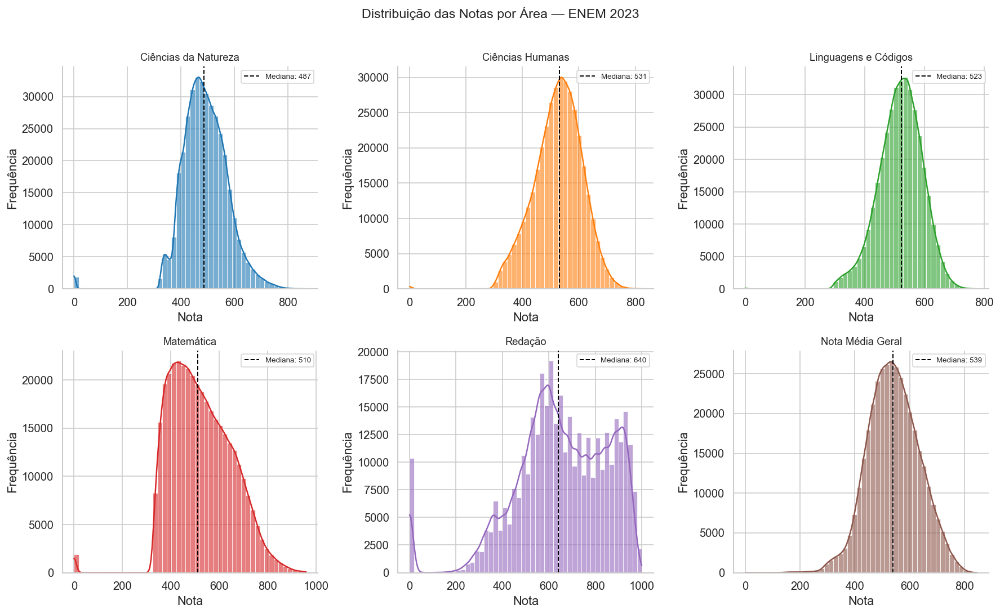</td>
    <td>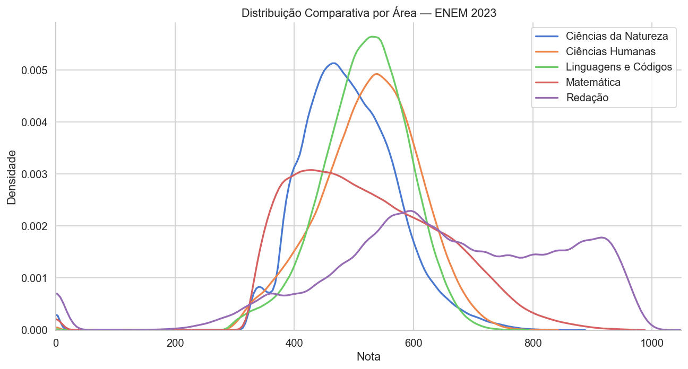</td>
  </tr>
  <tr>
    <td align="center">Distribuição por área</td>
    <td align="center">KDE comparativo</td>
  </tr>
  <tr>
    <td>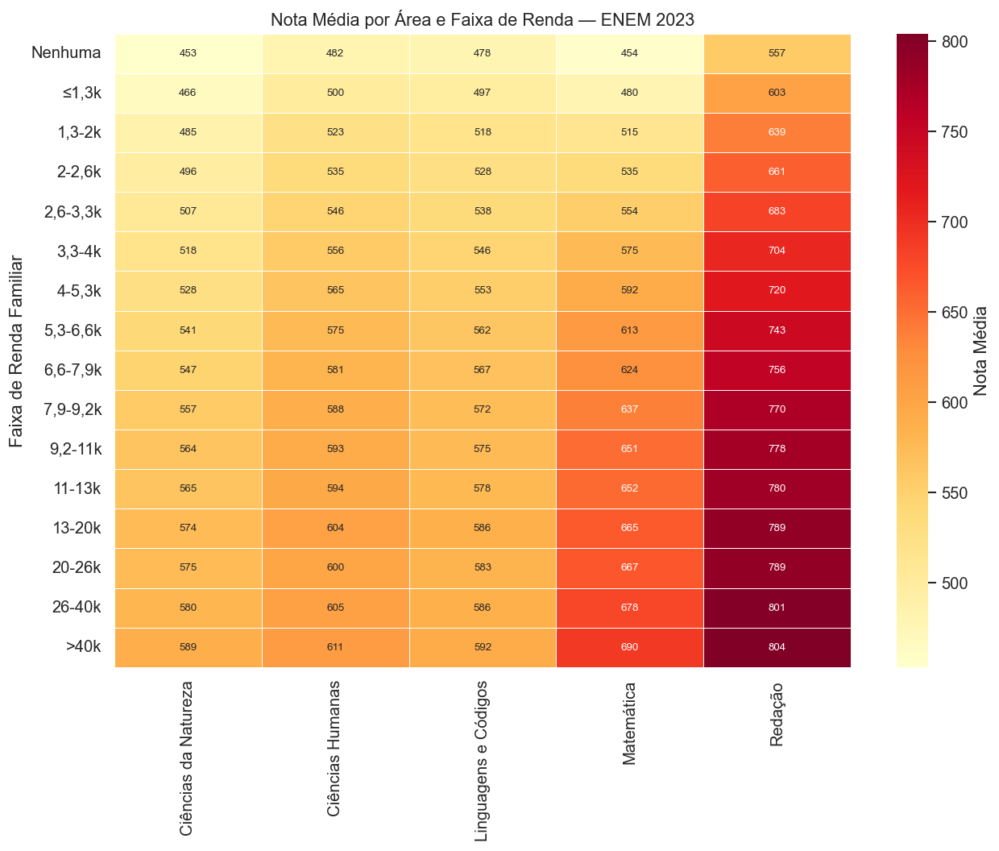</td>
    <td>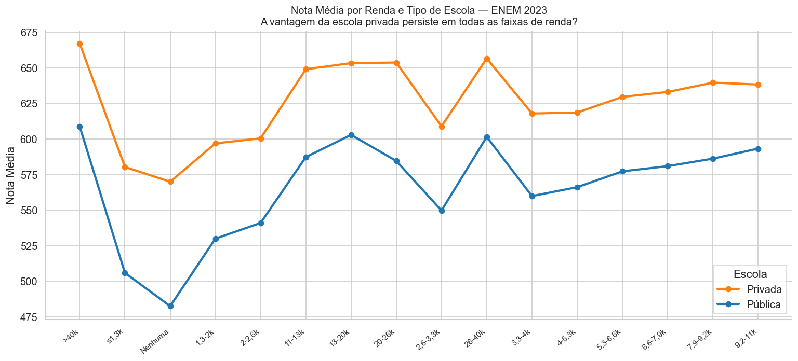</td>
  </tr>
  <tr>
    <td align="center">Nota média por área × renda</td>
    <td align="center">Vantagem da escola privada por faixa de renda</td>
  </tr>
  <tr>
    <td>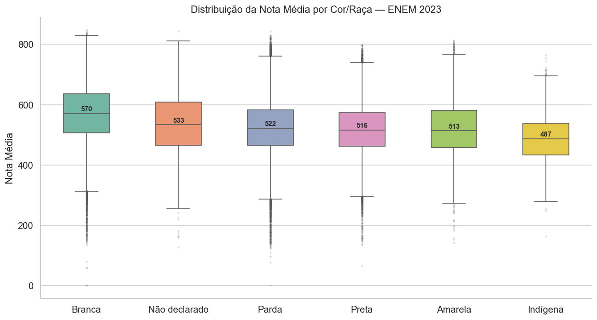</td>
    <td>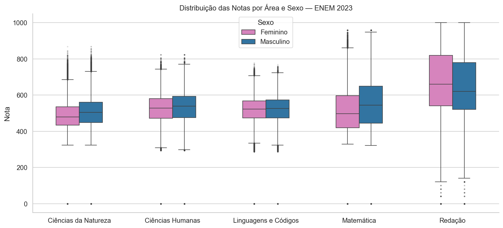</td>
  </tr>
  <tr>
    <td align="center">Desempenho por cor/raça</td>
    <td align="center">Desempenho por sexo e área</td>
  </tr>
  <tr>
    <td>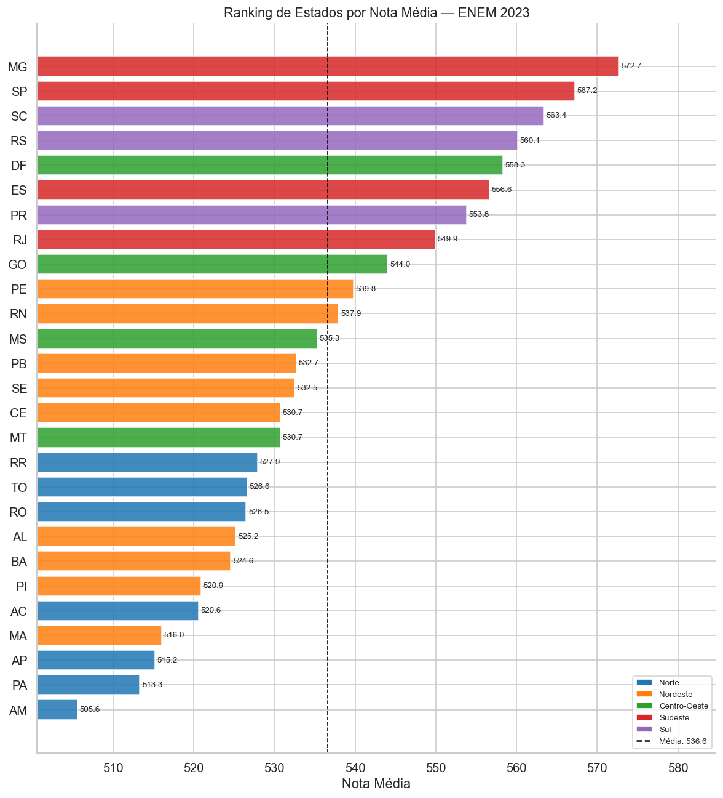</td>
    <td>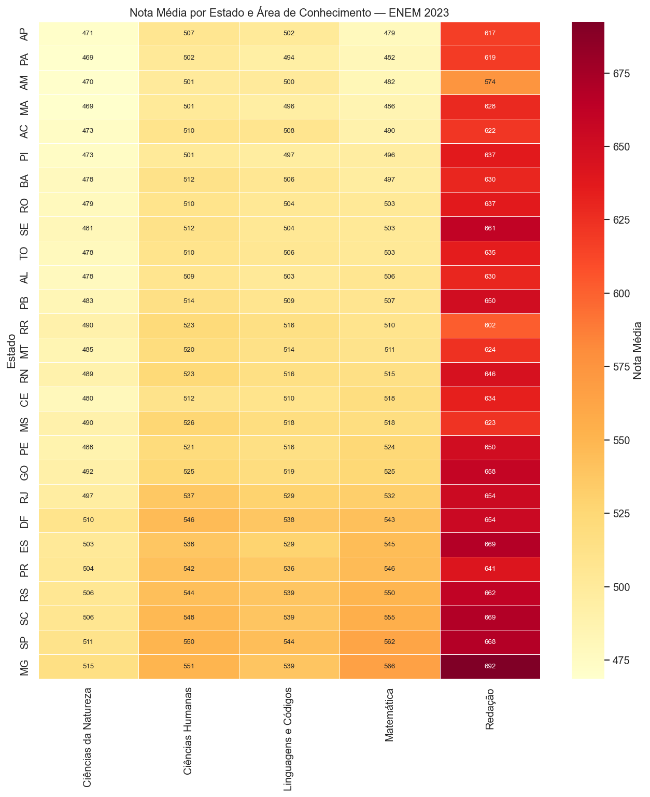</td>
  </tr>
  <tr>
    <td align="center">Ranking dos 27 estados por nota média</td>
    <td align="center">Heatmap estado × área de conhecimento</td>
  </tr>
  <tr>
    <td>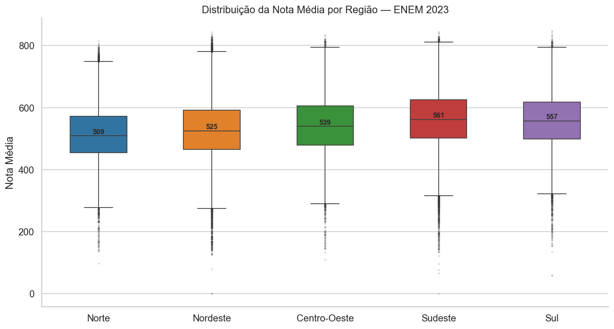</td>
    <td>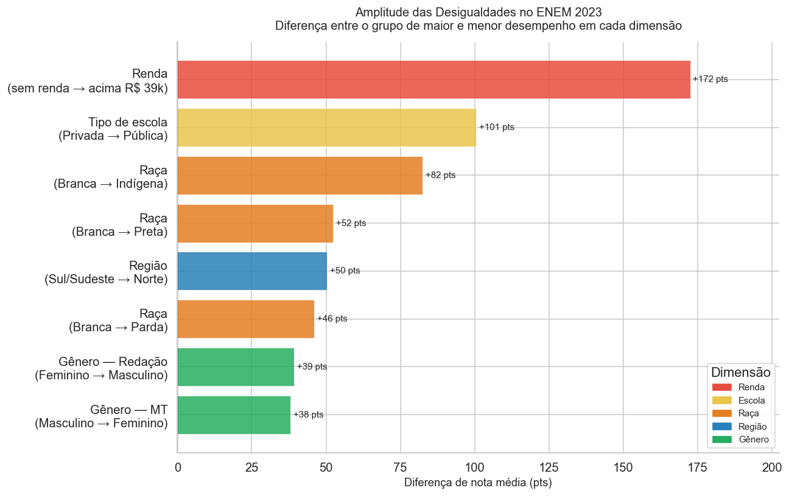</td>
  </tr>
  <tr>
    <td align="center">Distribuição da nota por região</td>
    <td align="center">Amplitude das desigualdades (síntese)</td>
  </tr>
  <tr>
    <td>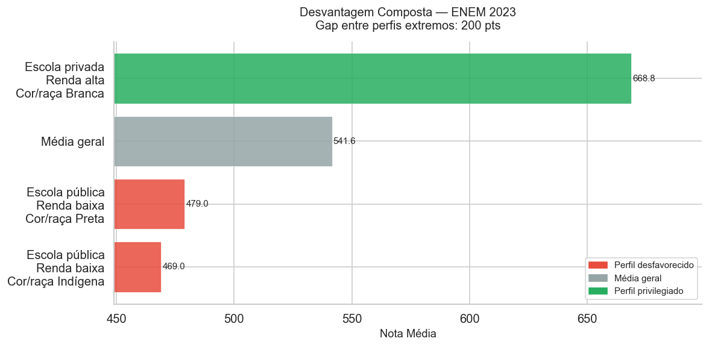</td>
    <td></td>
  </tr>
  <tr>
    <td align="center">Desvantagem composta por perfil</td>
    <td></td>
  </tr>
</table>

---

## Como Reproduzir

```bash
# 1. Clone o repositório
git clone https://github.com/Rodrigotorres1/enem-insights.git
cd enem-insights

# 2. Instale as dependências
pip install -r requirements.txt

# 3. Baixe os microdados do ENEM 2023 no portal do INEP
#    e coloque o arquivo ZIP em data/raw/

# 4. Execute os notebooks em ordem
jupyter notebook notebooks/
```

> **Requisito:** Python 3.11+

---

## Stack

- **Python 3.11** — linguagem principal
- **Pandas / NumPy** — manipulação e análise de dados
- **Matplotlib / Seaborn** — visualizações estáticas
- **Plotly** — mapa choropleth interativo (03b)
- **PyArrow** — leitura/escrita eficiente em Parquet

---

## Autor

**Rodrigo Torres**  
Estudante de Ciência da Computação — foco em Data Science  
[GitHub](https://github.com/Rodrigotorres1)
